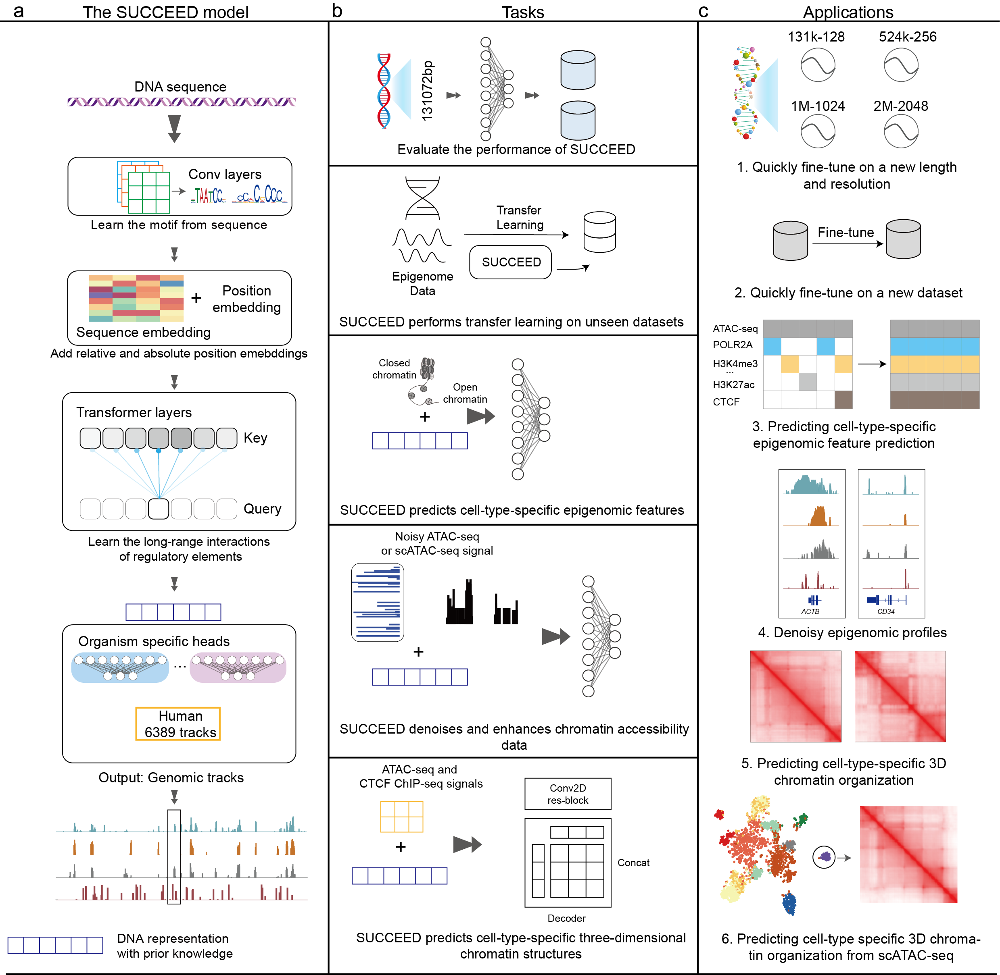

[](https://doi.org/10.5281/zenodo.18857226)

# SUCCEED

## Citation
If you use SUCCEED in your research, please cite:

Sun C Z, He Z J, Zhang S F. *Large-scale data-driven pre-trained DNA models enhance performance across diverse genomics tasks* [J]. **Nature Communications**, 2026.

SUCCEED is a supervised genomic pretraining framework. It demonstrates robust predictive performance across diverse datasets and resolutions, enhances the prediction of cell type–specific epigenetic modifications, improves the quality of chromatin accessibility data, and achieves superior accuracy in inferring three-dimensional chromatin interactions from limited scATAC-seq data. These results establish a foundation for unified multi-omic computational analysis.


## Table of Contents
- [SUCCEED](#succeed)
  - [Installation](#installation)
  - [1. Train from scratch](#1-train-from-scratch)
  - [2. Fine-tuning on new dataset](#2-fine-tuning-on-new-dataset)
  - [3. Epigenomic feature prediction (EFP)](#3-epigenomic-feature-prediction-efp)
  - [4. Denoising and enhancement of epigenomics data](#4-denoising-and-enhancement-of-epigenomics-data)
  - [5. Cell-type-specific prediction of 3D chromatin organization](#5-cell-type-specific-prediction-of-3d-chromatin-organization)

## Installation

### Prerequisites
- Python 3.11.2
- CUDA 12.1 compatible GPU
- Conda package manager

### Step 1: Clone Repository
```shell
git clone https://github.com/bioczsun/SUCCEED.git
cd SUCCEED
```

### Step 2: Create Conda Environment
```shell
conda create -n succeed -c bioconda -c conda-forge python=3.11.2 basenji
conda activate succeed
```

### Step 3: Install Dependencies
```shell
# Install PyTorch 2.5.1 with CUDA 12.1
pip install torch==2.5.1 torchvision==0.20.1 torchaudio==2.5.1 --index-url https://download.pytorch.org/whl/cu121

# Install additional dependencies
conda install -c bioconda -c conda-forge tqdm einops==0.7.0 ucsc-bedgraphtobigwig
pip install torchmetrics==0.11.4
```

### Step 4: Verify Installation
```shell
python -c "import torch; print(torch.cuda.is_available())"
```

---

## 1. Train from scratch
We use a simple example on a small dataset (5 targets) to demonstrate how to train the SUCCEED model.

### Data Preparation

#### Step 1: Prepare data Genome
```shell
cd SUCCEED
mkdir -p data && wget -O - https://hgdownload.cse.ucsc.edu/goldenpath/hg38/bigZips/hg38.fa.gz | gzip -d > data/hg38.fa
mkdir -p data && wget -O - https://hgdownload.cse.ucsc.edu/goldenpath/hg19/bigZips/hg19.fa.gz | gzip -d > data/hg19.fa
```

#### Step 2: Prepare Dataset
```shell
conda activate succeed

# We datad basenji's approach to dataset preparation, using hg38.fa as the data genome
# data/target_5.txt contains 5 BigWig files, which need to be downloaded in advance from the ENCODE database, 
# and the corresponding folder paths should be updated. 
# Here we use the signal p-value tracks generated by the ENCODE standard processing pipeline. 
# If you wish to use other tracks, you can replace them accordingly.

python src/preprocess/basenji_data.py -s 1 -g data/hg38_gap.bed \
    -l 131072 --local -o "result/training/131k-128" -p 48 -t .1 -v .1 -w 128 \
    -b data/hg38-blacklist.v2.bed data/hg38.fa data/target_5.txt

python src/preprocess/prepare_succeed_dataset.py \
    --fasta data/hg38.fa \
    --bed result/training/131k-128/sequences.bed \
    --num_targets 5 \
    --output_dir result/training/131k-128
```

### Pre-training a 131k-128bp model
```shell
python ~/SUCCEED/src/pretrain/train.py \
    --project_dir ~/SUCCEED \
    --output_head_size 5 \
    --td result/training/131k-128/train_all.h5 \
    --vd result/training/131k-128/valid_all.h5 \
    --name 131k \
    --seed 1401 \
    --lr 0.001 \
    --batch 8 \
    --out_dir result/training/131k-128/model
```

---

## 2. Fine-tuning on new dataset
Next, we use the fully pre-trained [131k-128bp model](https://drive.google.com/file/d/1oxs7fAf_UQyQifieRX6S8ONW9n0vBgrS/view?usp=drive_link) on the complete dataset (6,389 targets) to fine-tune a new dataset with different resolution (we still use the small dataset with 5 targets for testing), using 524k-512bp as an example.

Note: When performing fine-tuning at different resolutions, you need to manually modify the pool windows in the model/config.py.  
The resolution is equal to length / 1024.

### Data Preparation
```shell
python  ~/SUCCEED/src/preprocess/basenji_data.py -s 1 -g data/hg38_gap.bed \
    --break 7864320 -l 524288 --local -o "result/training/524k-512" -p 48 -t .1 -v .1 -w 512 \
    -b data/hg38-blacklist.v2.bed data/hg38.fa src/preprocess/target.txt

python ~/SUCCEED/src/preprocess/prepare_succeed_dataset.py \
    --fasta data/hg38.fa \
    --bed result/training/524k-512/sequences.bed \
    --num_targets 5 \
    --output_dir result/training/524k-512
```

### Fine-tuning a 524k-512bp model
Note that manual adjustment of pooling stride is required.
```shell
python ~/SUCCEED/src/pretrain/train.py \
    --project_dir ~/SUCCEED \
    --output_head_size 5 \
    --td result/training/524k-512/train_all.h5 \
    --vd result/training/524k-512/valid_all.h5 \
    --seed 1401 \
    --lr 0.001 \
    --batch 8 \
    --name 524k_131k_weight \
    --use_pth data/model/131k_corr_weight_10.10.1_best_network.pth \
    --out_dir result/training/524k-512/model
```

---

## 3. Epigenomic feature prediction (EFP)

### Data Preparation

#### Step 1: Prepare Pre-training Dataset
```shell
python src/preprocess/basenji_data.py -s 1 -g data/hg38_gap.bed \
    --break 7864320 -l 1048576 --local -o "result/training/1m-1024" -p 48 -t .1 -v .1 -w 1024 \
    -b data/hg38-blacklist.v2.bed data/hg38.fa src/preprocess/target.txt

python src/preprocess/prepare_succeed_dataset.py \
    --fasta data/hg38.fa \
    --bed result/training/1m-1024/sequences.bed \
    --num_targets 5 \
    --output_dir result/training/1m-1024
```

#### Step 2: Prepare EFP Dataset
```shell
mkdir -p data/dna_sequence

CHROMS=$(seq 1 22 | awk '{print "chr"$0}'; echo "chrX"; echo "chrY")

for chrom in ${CHROMS}; do
  samtools faidx data/hg38.fa "${chrom}" | gzip > "data/dna_sequence/${chrom}.fa.gz"
done

# The rest of the code will be available soon
```

### Pre-training a 1M-1024bp model
```shell
python src/training/train.py \
    --project_dir /home/hezj/projects/SUCCEED \
    --output_head_size 5 \
    --td result/training/1m-1024/train_all.h5 \
    --vd result/training/1m-1024/valid_all.h5 \
    --name 1M \
    --out_dir result/training/1m-1024/model
```

### Fine-tuning for EFP task
```shell
# Training on 4 ATAC-seq datasets (Optional)
python ~/SUCCEED/src/EFP/train_HistonTF.py \
  --project_dir ~/SUCCEED \
  --fasta hg38.fa \
  --bed /1M_sequences.bed \
  --h5_dir /h5 \
  --bw_dir /bw \
  --keys "GM12878,HepG2,K562,MCF-7" \
  --train_target_key train_target \
  --test_target_key test_target \
  --index_key index \
  --test_chroms "chr2,chr10,chr21" \
  --seed 1401 \
  --device cuda:0 \
  --batch_size 12 \
  --num_workers 10 \
  --lr 1e-4 \
  --epochs 200 \
  --patience 3 \
  --out_dir /outpath \
  --run_name ATAC_RPGC_4_ALL_Poisson \
  --succeed_ckpt SUCCEED_1M_best_network.pth
```

### Inference on the new dataset
```shell
# You can substitute the contig_bed with your own dataset
python ~/SUCCEED/src/EFP/inference_h5.py \
  --fasta /home/suncz/genome_index/mm10/mm10.fa \
  --atac_bw ENCFF155RBY_lung_RPGC.bigwig \
  --succeed_ckpt SUCCEED_1M_best_network.pth \
  --epcot_ckpt ATAC_RPGC_4_ALL_Poisson_Pvalue_23_best_network.pth \
  --head_name human \
  --out_channels 46 \
  --out_h5 mm10_ENCFF155RBY_lung_131072.h5 \
  --batch_size 1 \
  --device cuda:0 \
  --num_workers 8
```

---

## 4. Denoising and enhancement of epigenomics data

### Data Preparation

#### Bulk Dataset
```shell
# Training dataset on 4 cell types
  python ~/SUCCEED/src/atacwork/train_denoising.py \
    --project-dir ~/SUCCEED \
    --sequence-bed ~/Basenji2/downstream/ATACwork/data/data/200000/sequence.bed \
    --fasta /home/suncz/genome_index/hg19/hg19.fa \
    --model-ckpt ~/SUCCEED/data/model_pth/SUCCEED_131k_best_network.pth \
    --outpath ~/benchmark/AtacWorks/model \
    --device cuda:0 \
    --res 200000 \
    --seed 1401 \
    --batch-size 64 \
    --epochs 200 \
    --num-workers 8 \
    --cell-type-spec CD8-10,/noisy_data/CD8-10.200000.2.cutsites.smoothed.200.bw,/clean_data/CD8-10.50000000.1.cutsites.smoothed.200.bw,/clean_data/CD8-10.50000000.1.cutsites.smoothed.200.3.narrowPeak \
    --cell-type-spec Bcell-13,/noisy_data/Bcell-13.200000.2.cutsites.smoothed.200.bw,/clean_data/Bcell-13.50000000.1.cutsites.smoothed.200.bw,/clean_data/Bcell-13.50000000.1.cutsites.smoothed.200.3.narrowPeak \
    --cell-type-spec CD4-9,/noisy_data/CD4-9.200000.2.cutsites.smoothed.200.bw,/clean_data/CD4-9.50000000.1.cutsites.smoothed.200.bw,/clean_data/CD4-9.50000000.1.cutsites.smoothed.200.3.narrowPeak \
    --cell-type-spec Nkcell-11,/noisy_data/Nkcell-11.200000.2.cutsites.smoothed.200.bw,/clean_data/Nkcell-11.50000000.1.cutsites.smoothed.200.bw,/clean_data/Nkcell-11.50000000.1.cutsites.smoothed.200.3.narrowPeak


# Test dataset on erythroid
python ~/SUCCEED/src/atacwork/inference_succeed.py \
--fasta ~/genome_index/hg19/hg19.fa \
--sequence_bed ~/Basenji2/downstream/ATACwork/data/data/200000/sequence.bed \
--model ~/benchmark/AtacWorks/SUCCEED_200000_best_network.pth \
--model_epi ~/Encode_epigenome/results/preprocessed/131k-Basenji/human/model/131k_corr_weight_10.10.1_best_network.pth \
--noisy_bw ~/test/AtacWorks/data/atacworks-paper/bulk_blood_cell_denoising_experiments/200000_reads/test_data/erythroid_test_data/noisy_data/Erythro-15.200000.2.cutsites.smoothed.200.bw \
--outpath ~/benchmark/AtacWorks/LLM_Results/200000/ \
--chrom_size ~/genome_index/hg19/hg19.chrom.sizes

# Make peaks label bigwig file
tail -n +2 data/denoise/bulk_blood_cell_denoising_experiments/200000_reads/test_data/erythroid_test_data/clean_data/Erythro-15.50000000.1.cutsites.smoothed.200.3.narrowPeak | awk -F'\t' '{print $1 "\t" $2 "\t" $3 "\t" 1}' > data/denoise/bulk_blood_cell_denoising_experiments/200000_reads/test_data/erythroid_test_data/clean_data/peaks.bed

bedGraphToBigWig data/denoise/bulk_blood_cell_denoising_experiments/200000_reads/test_data/erythroid_test_data/clean_data/peaks.bed data/hg19.chrom.sizes data/denoise/bulk_blood_cell_denoising_experiments/200000_reads/test_data/erythroid_test_data/clean_data/peaks_label.bw
```

#### Single-cell Dataset
The process is similar to the bulk dataset. Please refer to the bulk dataset preparation for details.

---

## 5. Cell-type-specific prediction of 3D chromatin organization

### Data Preparation
We refer to the preprocess pipeline from the C.Origami paper to demonstrate the cell-type-specific prediction of 3D chromatin organization.

Using the IMR-90 cell line as an example, we need to prepare four types of data inputs:

1. DNA sequence
2. Hi-C
3. ATAC-seq
4. CTCF ChIP-seq

#### DNA sequence
```shell
mkdir -p result/hic/data/hg38/dna_sequence
cp data/centrotelo.bed result/hic/data/hg38

CHROMS=$(seq 1 22 | awk '{print "chr"$0}'; echo "chrX"; echo "chrY")

for chrom in ${CHROMS}; do
  samtools faidx data/hg38.fa "${chrom}" | gzip > "result/hic/data/hg38/dna_sequence/${chrom}.fa.gz"
done
```

#### Hi-C
```shell
mkdir -p result/hic/data/hg38/IMR-90

# Download Hi-C data
wget -O result/hic/data/hg38/IMR-90/IMR-90_HiC.mcool https://4dn-open-data-public.s3.amazonaws.com/fourfront-webprod/wfoutput/b4939d95-4121-4f86-9cc8-29a34eb834ef/4DNFIJTOIGOI.mcool

# Convert cool to npy
python -u src/hic/preprocessing/cool2npy.py \
    --no-balance \
    result/hic/data/hg38/IMR-90/IMR-90_HiC.mcool::/resolutions/10000 \
    result/hic/data/hg38/IMR-90/hic_matrix
```

#### ATAC-seq
```shell
mkdir -p result/3d_genome/data/hg38/IMR-90/genomic_features

# Download ATAC-seq data
wget -O result/3d_genome/data/hg38/IMR-90/genomic_features/IMR-90_ATAC.bam https://www.encodeproject.org/files/ENCFF848XMR/@@download/ENCFF848XMR.bam

# Preprocess ATAC-seq data
bash src/corigami/preprocessing/preprocess_atac.sh result/3d_genome/data/hg38/IMR-90/IMR-90_ATAC.bam
```

#### CTCF ChIP-seq
```shell
# Download CTCF ChIP-seq data
wget -O result/3d_genome/data/hg38/IMR-90/genomic_features/ctcf.bw https://www.encodeproject.org/files/ENCFF256DUS/@@download/ENCFF256DUS.bigWig
```

### Fine-tuning a 2M-8192bp model based on the 131k-128bp model (Optional)
```shell
python src/preprocess/basenji_data.py -s 1 -g data/hg38_gap.bed \
    --break 7864320 -l 2097152 --local -o "result/training/2m-8192" -p 48 -t .1 -v .1 -w 8192 \
    -b data/hg38-blacklist.v2.bed data/hg38.fa src/preprocess/target.txt

python src/preprocess/prepare_succeed_dataset.py \
    --fasta data/hg38.fa \
    --bed result/training/2m-8192/sequences.bed \
    --num_targets 5 \
    --output_dir result/training/2m-8192

python src/pretrain/train.py \
    --project_dir ~/SUCCEED \
    --output_head_size 5 \
    --td result/training/2m-8192/train_all.h5 \
    --vd result/training/2m-8192/valid_all.h5 \
    --seed 1401 \
    --lr 0.001 \
    --batch 8 \
    --name 2m_131k_weight \
    --use_pth data/model/131k_corr_weight_10.10.1_best_network.pth \
    --out_dir result/training/2m-8192/model
```

### Fine-tuning a 3D chromatin organization prediction model based on the 2M-8192bp model

#### Install external dependencies
```shell
conda activate succeed

pip install lightning==1.9.5
pip install pytorch_lightning==1.9.5
pip install lightning-bolts==0.7.0
```

#### Fine-tuning

##### Bulk dataset
```shell
python ~/SUCCEED/src/hic/training/main_alter.py \
  --project-dir ~/SUCCEED \
  --data-root ~/data/hg38 \
  --assembly hg38 \
  --celltype imr90 \
  --save_path outpath/ \
  --seed 1401 \
  --num-gpu 2 \
  --use-succeed-seq-model \
  --succeed-ckpt ~/SUCCEED/data/model_pth/SUCCEED_2M_best_network.pth
```

##### Single-cell dataset
The process is similar to the bulk dataset. Please refer to the bulk dataset preparation for details.


### All model .pth files and data used in the above examples can be found here:
https://drive.google.com/drive/folders/1wNIeZ9o5yW-bpPdHB7Ke0_O2q2ssthd9?usp=sharing
